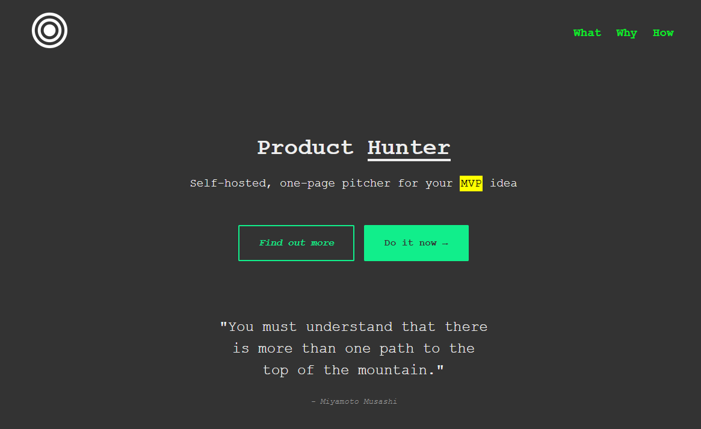

# Product-Hunter
Self-hosted, one-page pitcher for your MVP idea


As seen on https://producthunter.biz/





### Motivation
- We all need startup idea validator.
- No more stacked drawer full of untested ideas and MVPs!
- Don't lose time on frameworks, databases and hosting setup.
- Do people really think you have a good idea? If so will they sign up on your mailing list?
- Don't re-invent the wheel, find your niche customers first.
- Test your idea before going out.
- Fail fast!


### Setup
After editing and saving your page you will need to replace 3 more things:
- You will need <a href="https://flywidgets.com/">FlyWidget</a> account and a domain name. FlyWidget will then provide you with Pixel link you need to replace.
- Replace Google Analytics short code for your own.
- Replace BuyMeCoffe link with your own or remove it if you wish so.


### Live editing
This feature relies on ```designMode``` atribute of the ```document``` object of the page.
When you click 'Do it now' button onthe page, you can start changing the texts and images on the page.
Click again and you will be prompted to save the edited page to your computer.
Note that refreshing the page will reset all changes made. If you don't want to save the changes just click no when the dialog prompts you to save the page.


Inspired by <a href="https://andybrewer.github.io/mvp/?ref=producthunt">MVP.css</a> and <a href="https://github.com/chr15m/slingcode">Slingcode</a>


Product Hunter is open-source under MIT licence, feel free to fork, discuss and improve further. 

Enjoy!
